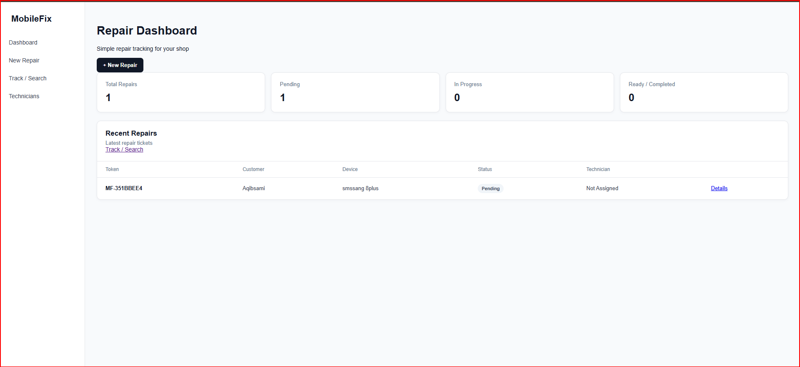
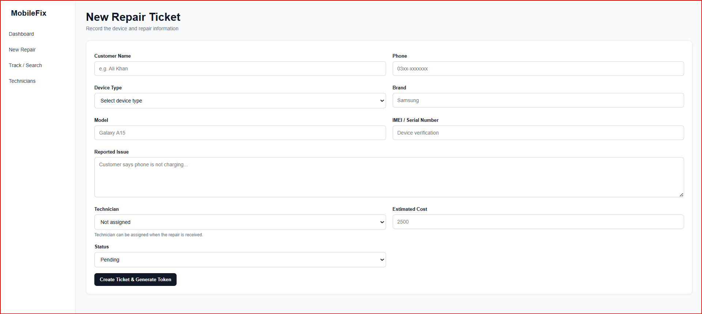
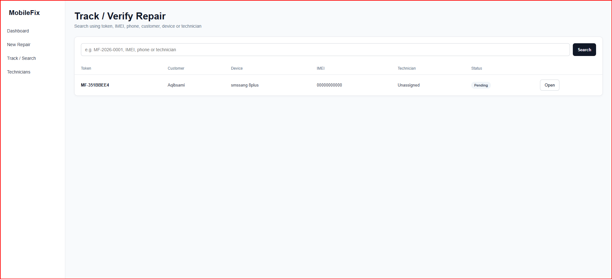
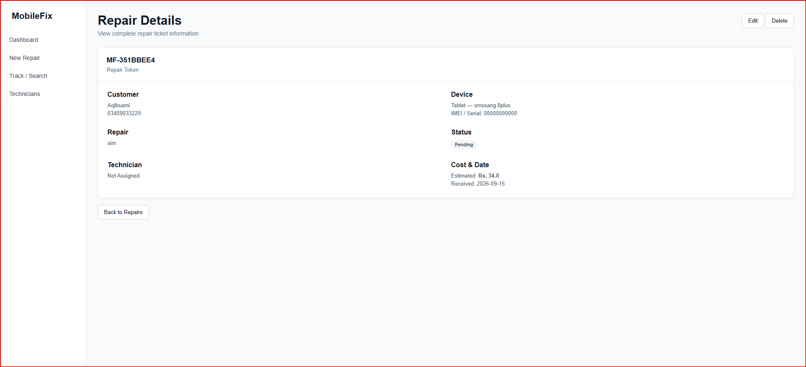
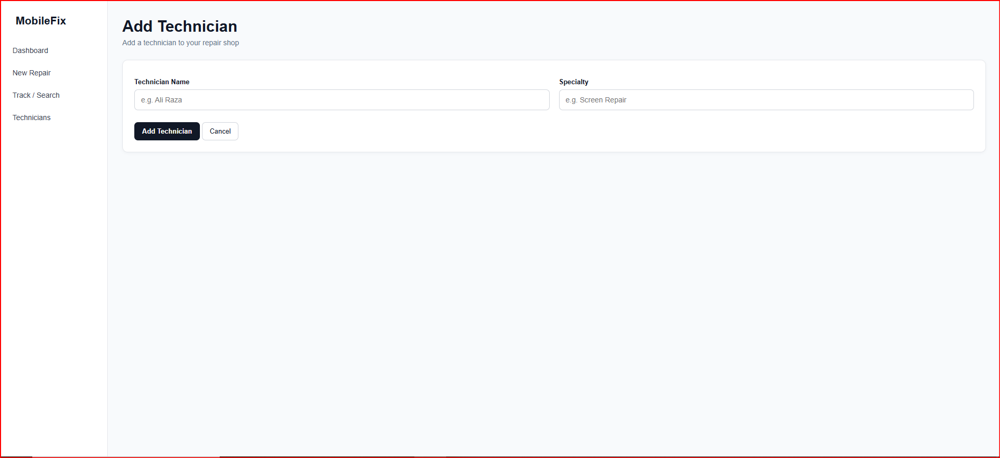

# 📱 MobileFix

A simple Windows-based Mobile Repair Shop Management System.

MobileFix helps repair shops create repair tickets, track devices, manage technicians, search repair records, and verify repair tickets using unique tokens.

---

## ✨ Features

- 🧾 Create repair tickets
- 🔑 Unique repair token for every ticket
- 📱 Store device and repair information
- 🔍 Search repairs by token, customer, phone, IMEI, device, or technician
- 👨‍🔧 Technician management
- 📊 Repair dashboard
- 🔄 Track repair status
- 💾 Local SQLite database
- 🖥️ Windows ready-to-use version

---

## 📸 Screenshots

### Dashboard

### New Repair

### Track / Search

### Ticket Details

### Technicians

---

# 📥 Download MobileFix

## Windows

Download the ready-to-use Windows version from the latest release:

**[⬇️ Download MobileFix for Windows](../../releases/latest)**

---

# 🚀 Installation & First Use

### 1. Download

Download the latest MobileFix ZIP file.

### 2. Extract

Right-click the downloaded ZIP file and select:

**Extract All**

### 3. Open the MobileFix folder

Open the extracted folder.

### 4. Find the application

Find:

`MobileFix.exe`

### 5. Start MobileFix

Double-click:

`MobileFix.exe`

The application will start and open in your web browser.

---

# 🖥️ Create Desktop Shortcut

After extracting MobileFix:

1. Find `MobileFix.exe`
2. Right-click it
3. Select **Show more options**
4. Select **Send to**
5. Select **Desktop (create shortcut)**

Now you can start MobileFix directly from your desktop.

---

# 📚 Documentation

### 👤 User Guide

Learn how to install and use MobileFix.

**[Open User Guide](docs/USER_GUIDE.md)**

### 👨‍💻 Developer Guide

Learn about the project structure and how developers can modify MobileFix.

**[Open Developer Guide](docs/DEVELOPER_GUIDE.md)**

### 📄 Complete Documentation

The complete project documentation is also available in:

`MobileFix_Complete_Documentation.docx`

---

# 👨‍💻 For Developers

MobileFix is an ASP.NET Core MVC application.

The source code is included in this repository so developers can study, modify, and improve the project.

Main project areas include:

- `Models` — Application data models
- `Controllers` — Application logic
- `Views` — User interface
- `Data` — Database context
- `wwwroot` — CSS, JavaScript and static files
- `Migrations` — Entity Framework Core database migrations

For more information, see the:

**[Developer Guide](docs/DEVELOPER_GUIDE.md)**

---

# 🛠️ Technology

- C#
- ASP.NET Core
- .NET
- MVC
- Entity Framework Core
- SQLite
- HTML
- CSS
- JavaScript

---

# 💾 Data

MobileFix uses a local SQLite database.

The application stores its database locally on the Windows computer.

No SQL Server installation is required for the ready-to-use Windows version.

---

# 📌 Project Purpose

MobileFix was created as a practical software project for managing mobile repair shop repair tickets and tracking repair work.

The project is also available as source code for developers who want to learn from it or extend its functionality.

---

# 📄 License

See the `LICENSE` file for licensing information.
